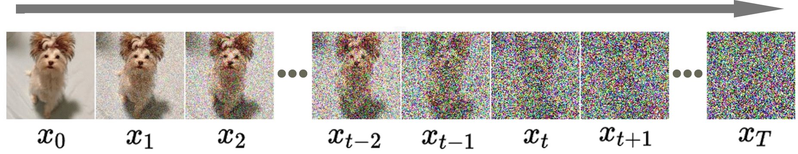
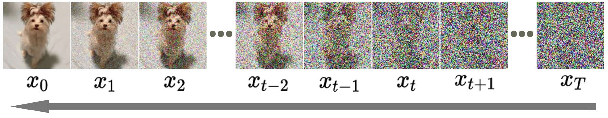

# Diffusion model in web browser

[Online Demo! Run it in your web browser ](https://wangjia184.github.io/diffusion_model/)

* 第一集: https://www.bilibili.com/video/BV1tz4y1h7q1 | 正态分布 | 基本设定 | 公式推导 |
* 第二集: https://www.bilibili.com/video/BV1xQ4y1w7ex | 神经网络 | 概率空间 | 边缘概率 | 各向同性高斯分布 |
* 第三集: https://www.bilibili.com/video/BV1hZ421y7id | 三维动画展示全过程
* 第四集: https://www.bilibili.com/video/BV1gK421b7W9 | 神经网络的学习目标以及训练
* 第五集: https://www.bilibili.com/video/BV12y421z7Mh/ | 花絮 | 热度图制作细节揭秘

[Youtube](https://www.youtube.com/watch?v=zEZOYZeIPUs&ab_channel=%E5%A4%A7%E7%99%BD%E8%AF%9DAI)

**UPDATE:**

* 2024-07-14 : Update online sample to use `WebGPU` if possible

-------------------

## 1. DDPM Introduction

* $q$ - a fixed (or predefined) **forward** diffusion process of adding Gaussian noise to an image gradually, until ending up with pure noise
* $p_θ$ - a learned **reverse** denoising diffusion process, where a neural network is trained to gradually denoise an image starting from pure noise, until ending up with an actual image.

Both the forward and reverse process indexed by $t$ happen for some number of finite time steps $T$ (the DDPM authors use $T$=1000). You start with $t=0$ where you sample a real image $x_0$ from your data distribution, and the forward process samples some noise from a Gaussian distribution at each time step $t$, which is added to the image of the previous time step. Given a sufficiently large $T$ and a well behaved schedule for adding noise at each time step, you end up with what is called an *isotropic Gaussian distribution* at $t=T$ via a gradual process

## 2. Forward Process $q$

$$ x_0 \overset{q(x_1 | x_0)}{\rightarrow} x_1 \overset{q(x_2 | x_1)}{\rightarrow} x_2 \rightarrow \dots  \rightarrow x_{T-1} \overset{q(x_{t} | x_{t-1})}{\rightarrow} x_T $$

This process is a markov chain, $x_t$ only depends on $x_{t-1}$. $q(x_{t} | x_{t-1})$ adds Gaussian noise at each time step $t$, according to a known variance schedule $β_{t}$ 

$$ x_t = \sqrt{1-β_t}\times x_{t-1} + \sqrt{β_t}\times \epsilon_{t} $$

* $β_t$ is not constant at each time step $t$. In fact one defines a so-called "variance schedule", which can be linear, quadratic, cosine, etc. 

$$ 0 < β_1 < β_2 < β_3 < \dots < β_T < 1 $$

* $\epsilon_{t}$ Gaussian noise, sampled from standard normal distribution.

$$ x_t = \sqrt{1-β_t}\times x_{t-1} + \sqrt{β_t} \times \epsilon_{t} $$

Define $a_t = 1 - β_t$

$$ x_t = \sqrt{a_{t}}\times x_{t-1} +  \sqrt{1-a_t} \times \epsilon_{t} $$

### 2.1 Relationship between $x_t$ and $x_{t-2}$

$$ x_{t-1} = \sqrt{a_{t-1}}\times x_{t-2} +  \sqrt{1-a_{t-1}} \times \epsilon_{t-1}$$ 

$$ \Downarrow  $$

$$ x_t = \sqrt{a_{t}} (\sqrt{a_{t-1}}\times x_{t-2} +  \sqrt{1-a_{t-1}} \epsilon_{t-1}) +  \sqrt{1-a_t} \times \epsilon_t $$

$$ \Downarrow  $$

$$ x_t = \sqrt{a_{t}a_{t-1}}\times x_{t-2} +  \sqrt{a_{t}(1-a_{t-1})} \epsilon_{t-1} +  \sqrt{1-a_t} \times \epsilon_t $$

Because $N(\mu_{1},\sigma_{1}^{2}) + N(\mu_{2},\sigma_{2}^{2}) = N(\mu_{1}+\mu_{2},\sigma_{1}^{2} + \sigma_{2}^{2})$

<a href="https://en.wikipedia.org/wiki/Sum_of_normally_distributed_random_variables" target="_blank">Proof</a>

$$ x_t = \sqrt{a_{t}a_{t-1}}\times x_{t-2} +  \sqrt{a_{t}(1-a_{t-1}) + 1-a_t} \times \epsilon $$

$$ \Downarrow  $$

$$ x_t = \sqrt{a_{t}a_{t-1}}\times x_{t-2} +  \sqrt{1-a_{t}a_{t-1}} \times \epsilon $$

### 2.2 Relationship between $x_t$ and $x_{t-3}$

$$ x_{t-2} = \sqrt{a_{t-2}}\times x_{t-3} +  \sqrt{1-a_{t-2}} \times \epsilon_{t-2} $$

$$ \Downarrow  $$

$$ x_t = \sqrt{a_{t}a_{t-1}}(\sqrt{a_{t-2}}\times x_{t-3} +  \sqrt{1-a_{t-2}} \epsilon_{t-2}) +  \sqrt{1-a_{t}a_{t-1}}\times \epsilon $$

$$ \Downarrow  $$

$$ x_t = \sqrt{a_{t}a_{t-1}a_{t-2}}\times x_{t-3}  +  \sqrt{a_{t}a_{t-1}(1-a_{t-2})} \epsilon_{t-2} +  \sqrt{1-a_{t}a_{t-1}}\times \epsilon $$

$$ \Downarrow  $$

$$ x_t = \sqrt{a_{t}a_{t-1}a_{t-2}}\times x_{t-3}  +  \sqrt{a_{t}a_{t-1}-a_{t}a_{t-1}a_{t-2}} \epsilon_{t-2} +  \sqrt{1-a_{t}a_{t-1}}\times \epsilon $$

$$ \Downarrow  $$

$$ x_t = \sqrt{a_{t}a_{t-1}a_{t-2}}\times x_{t-3}  +  \sqrt{(a_{t}a_{t-1}-a_{t}a_{t-1}a_{t-2}) + 1-a_{t}a_{t-1}} \times \epsilon $$

$$ \Downarrow  $$

$$ x_t = \sqrt{a_{t}a_{t-1}a_{t-2}}\times x_{t-3} +  \sqrt{1-a_{t}a_{t-1}a_{t-2}} \times \epsilon $$

### 2.3 Relationship between $x_t$ and $x_0$

* $x_t = \sqrt{a_{t}a_{t-1}}\times x_{t-2} +  \sqrt{1-a_{t}a_{t-1}}\times \epsilon$
* $x_t = \sqrt{a_{t}a_{t-1}a_{t-2}}\times x_{t-3} +  \sqrt{1-a_{t}a_{t-1}a_{t-2}}\times \epsilon$
* $x_t = \sqrt{a_{t}a_{t-1}a_{t-2}a_{t-3}...a_{t-(k-2)}a_{t-(k-1)}}\times x_{t-k} +  \sqrt{1-a_{t}a_{t-1}a_{t-2}a_{t-3}...a_{t-(k-2)}a_{t-(k-1)}}\times \epsilon$
* $x_t = \sqrt{a_{t}a_{t-1}a_{t-2}a_{t-3}...a_{2}a_{1}}\times x_{0} +  \sqrt{1-a_{t}a_{t-1}a_{t-2}a_{t-3}...a_{2}a_{1}}\times \epsilon$

$$\bar{a}_{t} := a_{t}a_{t-1}a_{t-2}a_{t-3}...a_{2}a_{1}$$

$$x_{t} = \sqrt{\bar{a}_t}\times x_0+ \sqrt{1-\bar{a}_t}\times \epsilon , \epsilon \sim N(0,I) $$

$$ \Downarrow  $$

$$ q(x_{t}|x_{0}) = \frac{1}{\sqrt{2\pi } \sqrt{1-\bar{a}_{t}}} e^{\left (  -\frac{1}{2}\frac{(x_{t}-\sqrt{\bar{a}_{t}}x_0)^2}{1-\bar{a}_{t}}   \right ) } $$

# 3.Reverse Process $p$

Because $P(A|B) = \frac{ P(B|A)P(A) }{ P(B) }$

$$ p(x_{t-1}|x_{t},x_{0}) = \frac{ q(x_{t}|x_{t-1},x_{0})\times q(x_{t-1}|x_0)}{q(x_{t}|x_0)} $$

<table>
  <tbody>
    <tr>
      <td>
         $$x_{t} = \sqrt{a_t}x_{t-1}+\sqrt{1-a_t}\times ϵ$$
      </td>
      <td>
        ~
      </td>
      <td>
        $N(\sqrt{a_t}x_{t-1}, 1-a_{t})$
      </td>
    </tr>
    <tr>
      <td>
        $$x_{t-1} = \sqrt{\bar{a}_{t-1}}x_0+ \sqrt{1-\bar{a}_{t-1}}\times ϵ$$
      </td>
      <td>
        ~
      </td>
      <td>
        $N( \sqrt{\bar{a}_{t-1}}x_0, 1-\bar{a}_{t-1})$
      </td>
    </tr>
    <tr>
      <td>
        $$x_{t} = \sqrt{\bar{a}_{t}}x_0+ \sqrt{1-\bar{a}_{t}}\times ϵ$$
      </td>
      <td>
        ~
      </td>
      <td>
        $N( \sqrt{\bar{a}_{t}}x_0, 1-\bar{a}_{t})$
      </td>
    </tr>
  </tbody>
  
</table>

$$ q(x_{t}|x_{t-1},x_{0}) = \frac{1}{\sqrt{2\pi } \sqrt{1-a_{t}}} e^{\left (  -\frac{1}{2}\frac{(x_{t}-\sqrt{a_t}x_{t-1})^2}{1-a_{t}}   \right ) } $$

$$ q(x_{t-1}|x_{0}) = \frac{1}{\sqrt{2\pi } \sqrt{1-\bar{a}_{t-1}}} e^{\left (  -\frac{1}{2}\frac{(x_{t-1}-\sqrt{\bar{a}_{t-1}}x_0)^2}{1-\bar{a}_{t-1}}   \right ) } $$

$$ q(x_{t}|x_{0}) = \frac{1}{\sqrt{2\pi } \sqrt{1-\bar{a}_{t}}} e^{\left (  -\frac{1}{2}\frac{(x_{t}-\sqrt{\bar{a}_{t}}x_0)^2}{1-\bar{a}_{t}}   \right ) } $$

$$ \frac{ q(x_{t}|x_{t-1},x_{0})\times q(x_{t-1}|x_0)}{q(x_{t}|x_0)} = \left [
  \frac{1}{\sqrt{2\pi} \sqrt{1-a_{t}}} e^{\left (  -\frac{1}{2}\frac{(x_{t}-\sqrt{a_t}x_{t-1})^2}{1-a_{t}}   \right ) } 
\right ] * 
\left [ 
\frac{1}{\sqrt{2\pi} \sqrt{1-\bar{a}_{t-1}}} e^{\left (  -\frac{1}{2}\frac{(x_{t-1}-\sqrt{\bar{a}_{t-1}}x_0)^2}{1-\bar{a}_{t-1}}   \right ) }  
\right ] \div
\left [ 
  \frac{1}{\sqrt{2\pi} \sqrt{1-\bar{a}_{t}}} e^{\left (  -\frac{1}{2}\frac{(x_{t}-\sqrt{\bar{a}_{t}}x_0)^2}{1-\bar{a}_{t}}   \right ) }
\right ]  $$

$$ \Downarrow  $$

  $$
  \frac{\sqrt{2\pi} \sqrt{1-\bar{a}_{t}}}{\sqrt{2\pi} \sqrt{1-a_{t}} \sqrt{2\pi} \sqrt{1-\bar{a}_{t-1}} }
  e^{\left [ -\frac{1}{2}
  \left (
    \frac{(x_{t}-\sqrt{a_t}x_{t-1})^2}{1-a_{t}} +
    \frac{(x_{t-1}-\sqrt{\bar{a}_{t-1}}x_0)^2}{1-\bar{a}_{t-1}} -
    \frac{(x_{t}-\sqrt{\bar{a}_{t}}x_0)^2}{1-\bar{a}_{t}}
  \right )
  \right]}
  $$

$$ \Downarrow  $$

  $$\frac{1}{\sqrt{2\pi} \left( 
    \frac{\sqrt{1-a_t} \sqrt{1-\bar{a}_{t-1}}}{\sqrt{1-\bar{a}_{t}}}
  \right)}
  \exp \left[ -\frac{1}{2}
  \left(
    \frac{(x_{t}-\sqrt{a_t}x_{t-1})^2}{1-a_t} +
    \frac{(x_{t-1}-\sqrt{\bar{a}_{t-1}}x_0)^2}{1-\bar{a}_{t-1}} -
    \frac{(x_{t}-\sqrt{\bar{a}_{t}}x_0)^2}{1-\bar{a}_{t}}
  \right)
  \right] $$

$$ \Downarrow  $$

  $$ \frac{1}{\sqrt{2\pi} \left( 
    \frac{\sqrt{1-a_t} \sqrt{1-\bar{a}_{t-1}}}{\sqrt{1-\bar{a}_{t}}}
  \right)}
  \exp \left[ -\frac{1}{2}
  \left (
    \frac{
      x_{t}^2-2\sqrt{a_t}x_{t}x_{t-1}+{a_t}x_{t-1}^2
    }{1-a_t} +
    \frac{
      x_{t-1}^2-2\sqrt{\bar{a}_{t-1}}x_0x_{t-1}+\bar{a}_{t-1}x_0^2
    }{1-\bar{a}_{t-1}} -
    \frac{(x_{t}-\sqrt{\bar{a}_{t}}x_0)^2}{1-\bar{a}_{t}}
  \right)
  \right] $$

$$ \Downarrow  $$

  $$\frac{1}{\sqrt{2\pi} \left( 
      \frac{\sqrt{1-a_t} \sqrt{1-\bar{a}_{t-1}}}{\sqrt{1-\bar{a}_{t}}}
  \right)}
  \exp \left[ -\frac{1}{2}
  \frac{
    \left(
      x_{t-1} - \left(
          \frac{\sqrt{a_t}(1-\bar{a}_{t-1})}{1-\bar{a}_t}x_t
          +
          \frac{\sqrt{\bar{a}_{t-1}}(1-a_t)}{1-\bar{a}_t}x_0
      \right)
    \right)^2
  }{ \left( 
        \frac{\sqrt{1-a_t} \sqrt{1-\bar{a}_{t-1}}}{\sqrt{1-\bar{a}_{t}}}
    \right)^2
  } \right]$$

$$ \Downarrow  $$

  
    $$ p(x_{t-1}|x_{t}) \sim N\left( 
      \frac{\sqrt{a_t}(1-\bar{a}_{t-1})}{1-\bar{a}_t}x_t
      +
      \frac{\sqrt{\bar{a}_{t-1}}(1-a_t)}{1-\bar{a}_t}x_0,
    
  
  
    \left( \frac{\sqrt{1-a_t} \sqrt{1-\bar{a}_{t-1}}}{\sqrt{1-\bar{a}_{t}}} \right)^2
  \right) $$
  

Because $x_{t} = \sqrt{\bar{a}_t}\times x_0+ \sqrt{1-\bar{a}_t}\times \epsilon$, $x_0 = \frac{x_t - \sqrt{1-\bar{a}_t}\times \epsilon}{\sqrt{\bar{a}_t}}$. Substitute $x_0$ with this formula.

 

  
    $$ p(x_{t-1}|x_{t}) \sim N\left( 
      \frac{\sqrt{a_t}(1-\bar{a}_{t-1})}{1-\bar{a}_t}x_t
      +
      \frac{\sqrt{\bar{a}_{t-1}}(1-a_t)}{1-\bar{a}_t}\times \frac{x_t - \sqrt{1-\bar{a}_t}\times \epsilon}{\sqrt{\bar{a}_t}},
    
  
  
    \frac{\beta_{t} (1-\bar{a}_{t-1})}{1-\bar{a}_{t}} 
  \right) $$
  

  
     $$ p(x_{t-1}|x_{t}) \sim N\left( 
      \frac{\sqrt{a_t}(1-\bar{a}_{t-1})}{1-\bar{a}_t}x_t
      +
      \frac{\sqrt{\bar{a}_{t-1}}(1-a_t)}{1-\bar{a}_t}\times \frac{x_t - \sqrt{1-\bar{a}_t}\times \epsilon}{\sqrt{\bar{a}_t}},
    
  
  
    \frac{\beta_{t} (1-\bar{a}_{t-1})}{1-\bar{a}_{t}} 
  \right) $$
  

**Note:** This `README.md` is intended solely for previewing on the Github page. If you wish to view the rendered page locally, please consult `README.raw.md`.
